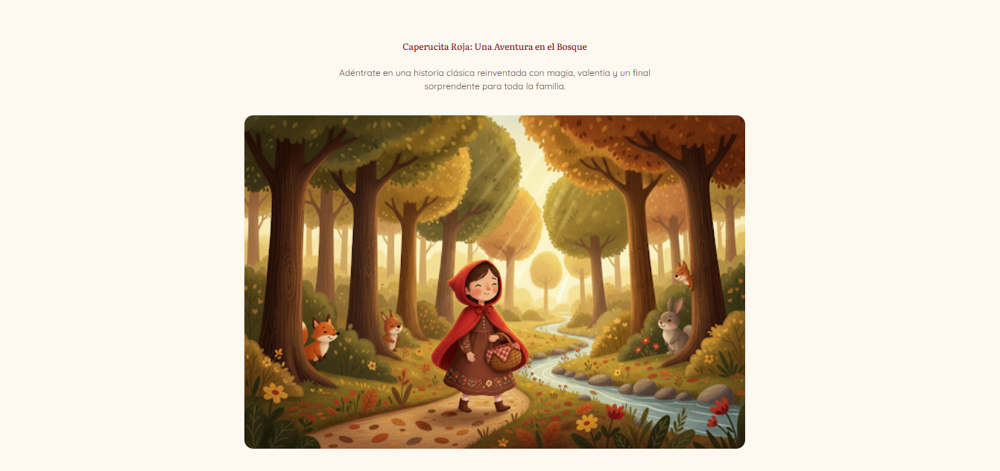
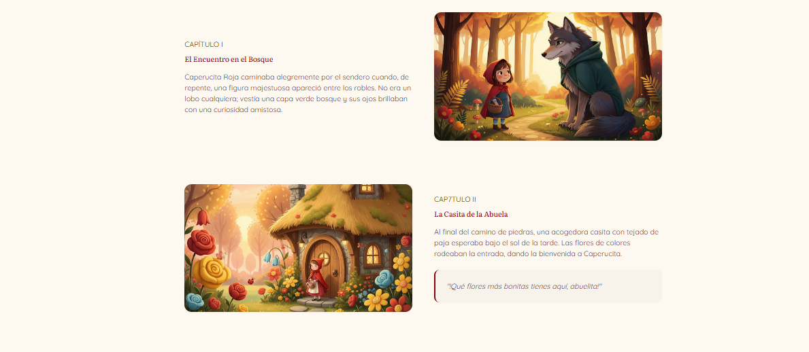
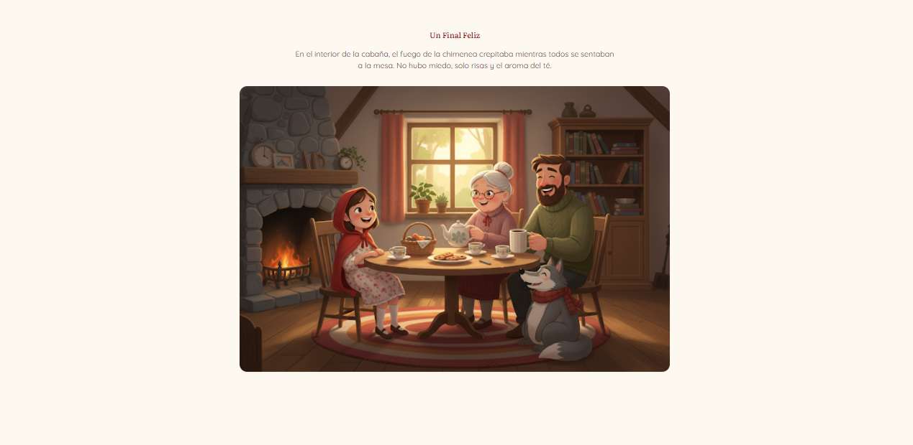
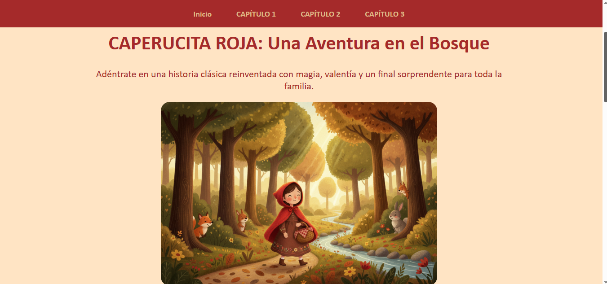
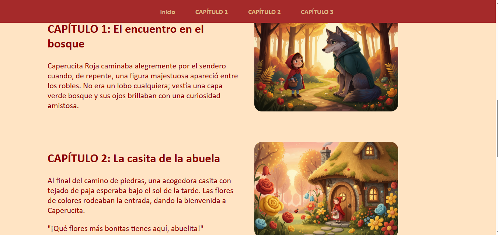
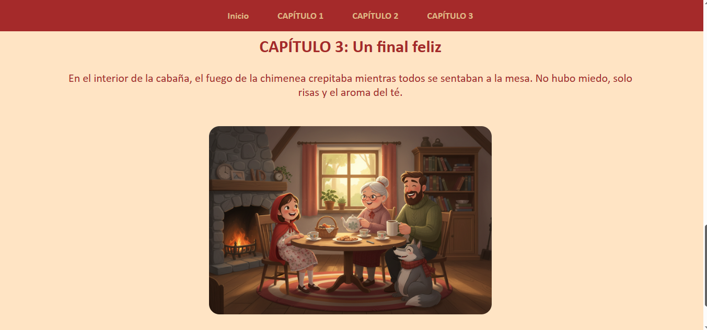
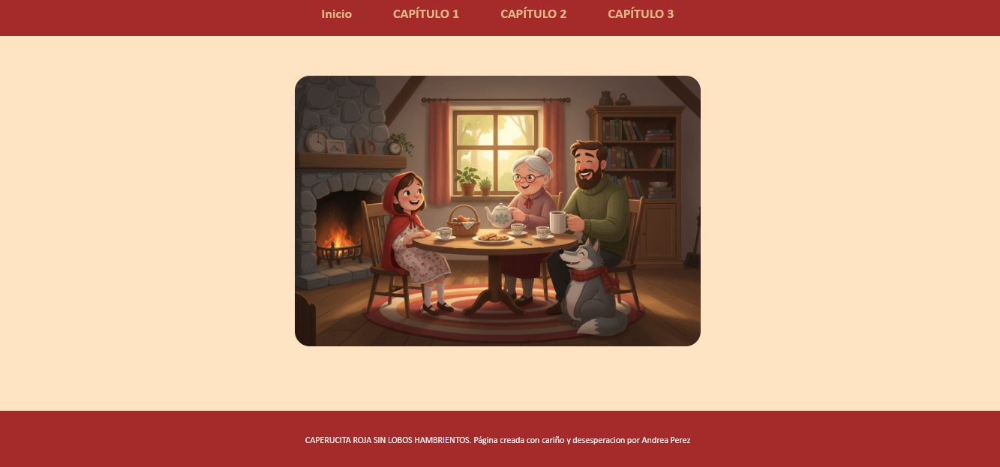

# -ex-git-little-red-riding-hood
# PROYECTO:CAPERUCITA ROJA
## ESTRUCTURA Y PLANIFICACIÓN DEL PROYECTO:
Este proyecto está creado de manera visual e interactiva para un fácil uso de la página web, con imagenes ilustrativas y textos cortos.

CAPÍTULO 1: El encuentro en el bosque

CAPÍTULO 2: La casita de la abuela

CAPÍTULO 3: Un final feliz

TECNOLOGÍAS USADAS: HTML y CSS

##ACCESIBILIDAD Y DISEÑO:

Incorporé imagenes referentes al texto con un tamaño de letra acorde a estas, unos colores de página que hacen referencia al cuento y una buena legibilidad para todo tipo de público.

## proyecto google stitch:

Mi proyecto se ha basado en el siguiente, haciendo cambios según iba avanzando.

## PLANIFICACIÓN DE COMMITS

mi planificación de commits no ha sido la más precisa del mundo, pero empecé a desarrollar mi página web asi:

##configuración inicial:

-"feat": añadir HTML inicial
-"feat":aladir CSS

## CONTENIDO

-"feat": añadir encabezado y breve descripción de la historia

-"feat": añadir 'CAPÍTULO 1', tanto titulo como desarrollo 

-"feat": añadir 'CAPÍTULO 2', tanto título como desarrollo

-"feat": añadir 'CAPÍTULO 3', tanto título como desarrollo

-"feat": añadir cabecera a la página con botones interactivos

-"feat": añadir footer como final de página

## DISEÑO

-"feat": añadir tipografía

-"feat": añadir colores tanto de background como de fuente de letra

-"feat":estructurar los textos y las imagenes a diferentes alturas

-"feat": configuración del tamaño de las imagenes

-"feat": establecer un color para la cabecera y para el footer.

## RESULTADO FINAL

